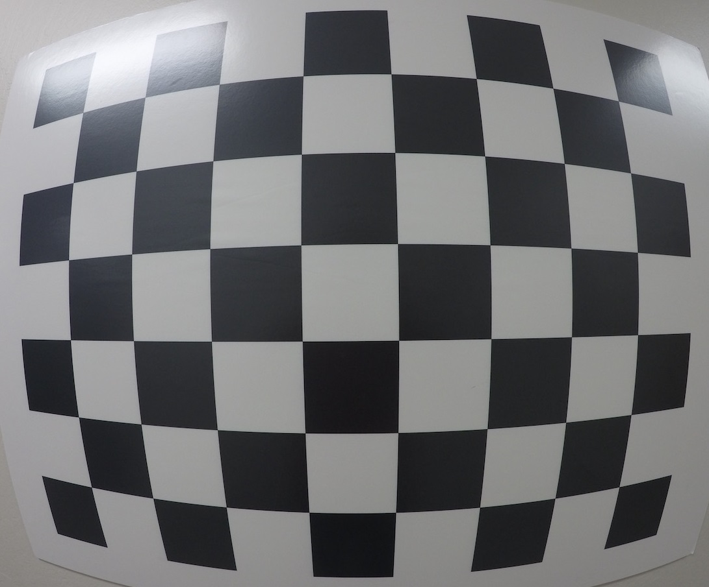
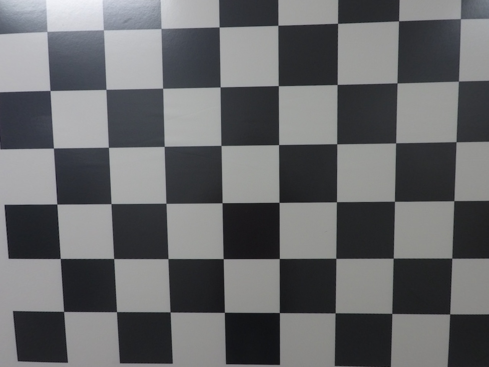

# Advanced-Lane-finder

**Requirements:**  
1- numpy  
2- opencv-python  
3- matplotlib  
4-   

This is an implementation of what I've learnt in Udacity's self driving course about creating an advanced lane finder project.

You can use the code and change various parts of it to have better results, since it'll be easier for you to read the code with explained comments of mine. 
Also I will provide a link that contains Udacity's instructions about the course (which does not include the code, but specifies the way to implement it) at the end of the paper.

Steps to be taken in order to create this algorithm:

__1-__ Compute the camera calibration matrix and distortion coefficients given a set of chessboard images. Then save the parameters for later use.

__Original image__  
  

  
__Undistorted image__  
    

__Note:__ As you can see the result of camera calibration is succesfull and parameters are saved in the script.Check camera_calibration script for more details.
