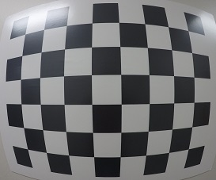
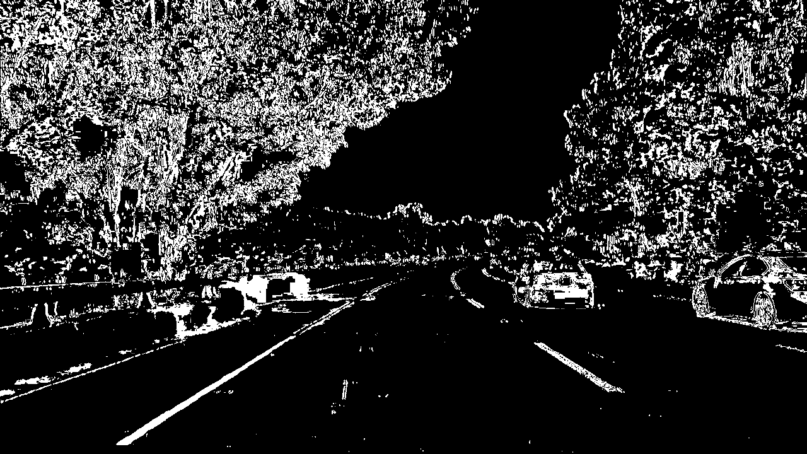
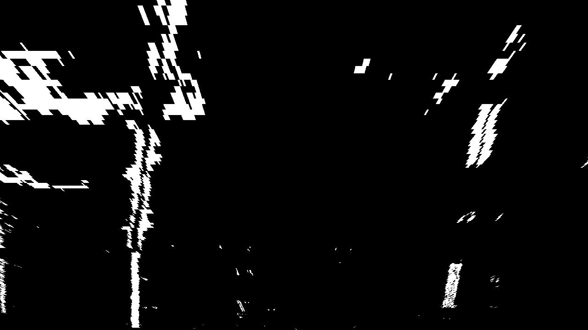
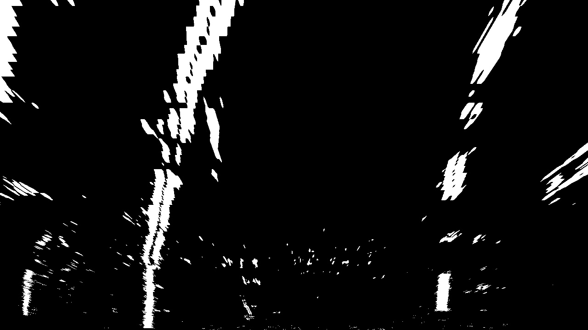
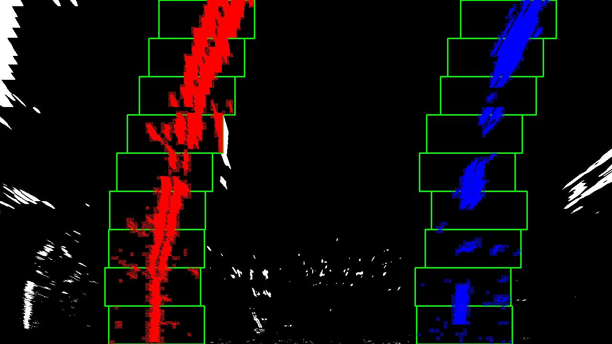
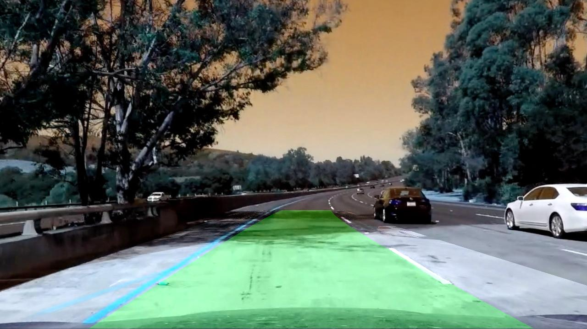

# Advanced-Lane-finder

**Requirements:**  
```
pip install numpy  
pip install opencv-python  
pip install matplotlib  
pip install pillow  

```


This is an implementation of what I've learnt in Udacity's self driving course about creating an advanced lane finder project.

You can use the code and change various parts of it to have better results, since it'll be easier for you to read the code with explained comments of mine. 
Also I will provide a link that contains Udacity's instructions about the course (which does not include the code, but specifies the way to implement it) at the end of the paper.


Steps to be taken in order to create this algorithm:

## __1-Camera Calibration__   
Compute the camera calibration matrix and distortion coefficients given a set of chessboard images. Then save the parameters for later use.


__Original image:__  
  

  
__Undistorted image:__  
    

__Note:__ As you can see the result of camera calibration is succesfull and parameters are saved in the script.Check camera_calibration script for more details.


## __2-Pipeline__  
Using the combinations of color and gradient spaces with the goal achiving the pipeline  

Here's a sample of pipeline applied on single image  

The final image is a combination of binary thresholding the S channel (HLS) and the result of applying the Sobel operator in the x direction on the original image.


__Original image:__  
  

  
__Thresholded image:__  
    


__Note:__ This is the outcome of color_gradient script to be used in perspective transform later on.  


## __3-Perspective Transform__  

Perspective transform applied to the last image, more samples can be find in pics folder. Check warped script for more details.


__Transformed image:__  
   


## __4-Find Lane Lines__  

Now we have a thresholded, warped image and ready to map out the lane lines with the hep of a method called Peaks in a Histogram. The process is explained in find_lanes script in details.


__Warped image:__  
  

  
__Sliding windows of lane lines in image:__  
    


__Note:__ This is a single image implementation to be used once, you can find the code in lane_finder script.The actual code is going to search polynomial for lane lines from prior search which will make it much more faster.  

## __5-Draw polynomial on image__  

Last operation to apply in here is using the inverse matrix of M ,which is used to create perspective transform, painting the area between 2 lines and transforming it back on image. At the end we have a clear picture of dedected lane lines as shown.  

   
